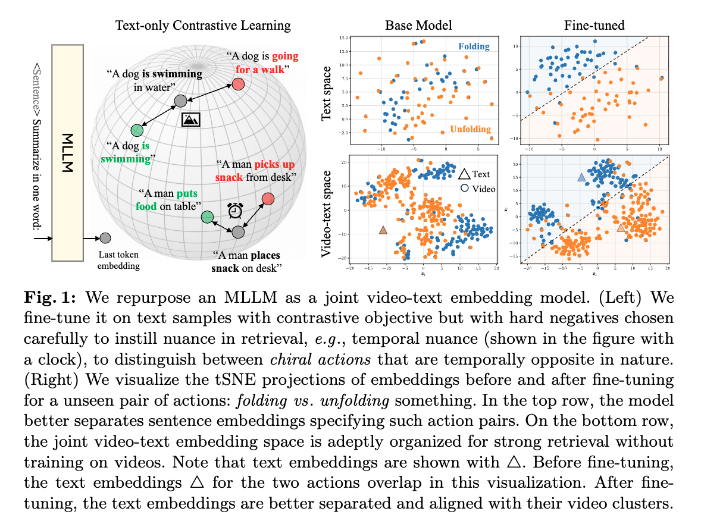

#  TARA: Text-Adapted Retrieval Alignment for Nuanced Video Retrieval
<!-- #  TARA: Time-Aware Retrieval Adaptation for Video Understanding -->

Sample change.

This repository contains inference and evaluation code for the TARA model based on the paper:
[Adapting MLLMs for Nuanced Video Retrieval](https://arxiv.org/abs/2512.13511)

<!-- Show arch fig in 80% of the screen and center it -->

<!-- Add a caption with small font size and center it such that it align with image width and center it-->
<p style="text-align: left; font-size: 13px; width: 75%; display: block; margin: 0 auto;"><b>TARA Architecture:</b> We use EOL prompt to embed videos using an MLLM (Tarsier-7B). We train the LLM weights with contrastive loss on a combination of time-aware text triplets and static-biased text triplets.</p>


```bibtex
@article{tara2025,
  title={TARA: Simple and Efficient Time Aware Retrieval Adaptation of MLLMs for Video Understanding},
  author={Piyush Bagad and Andrew Zisserman},
  year={2025}
  journal={arXiv preprint arXiv:XXXX.XXXXX}
}
```

<!-- Add a Table of Contents here -->
## Table of Contents
- [Installation & Setup](#installation--setup)
- [Quick Start](#quick-start)
- [Evaluation](#evaluation)
  - [Chiral Retrieval](#chiral-retrieval)
  - [Verb recognition](#verb-recognition)
  - [Adverb recognition](#adverb-recognition)
  - [Standard video tasks in MMEB-v2](#standard-video-tasks-in-mmeb-v2)
  - [Video captioning](#video-captioning)
  - [Composed Video Retrieval](#composed-video-retrieval)
- [Citation](#citation)
- [License](#license)


## Installation & Setup

First, clone the repository:
```bash
git clone https://github.com/bpiyush/tara.git
cd tara
```


### 1. Install Git LFS (if not already installed)

Git LFS is required to download the model weights.

Please install Git LFS from https://git-lfs.github.com/.
You can refer to [this guide](https://gist.github.com/pourmand1376/bc48a407f781d6decae316a5cfa7d8ab) for non-sudo installation.
I have not tested this guide, but it should work.

Check the installation:
```bash
git lfs --version
git lfs install
```
The output should be:
```
git-lfs/3.4.1 (GitHub; linux amd64; go 1.20.11; git 0898dcbc
Updated Git hooks.
Git LFS initialized.
```


### 2. Download the Model Weights
```bash
git clone https://huggingface.co/bpiyush/TARA /path/to/download/tara
cd TARA
```

This will download all model weights (may take a few minutes depending on your connection).

### 3. Install Dependencies


* Create/activate the conda env (skip if you already have it):
   ```bash
   conda create -n tara python=3.10 -y
   conda activate tara
   ```
* Install CUDA 12.1 PyTorch wheels (adjust the index URL if you need a different CUDA/CPU build):
   ```bash
   pip install --index-url https://download.pytorch.org/whl/cu121 \
     torch==2.5.1+cu121 torchvision==0.20.1+cu121 torchaudio==2.5.1+cu121
   ```
* Install the remaining model dependencies:
   ```bash
   pip install -r requirements.txt
   ```
* (Optional) Verify the install:
   ```bash
   python -c "import torch, transformers; print(torch.cuda.is_available(), transformers.__version__)"
   ```


## Quick Start

TARA is primarily designed to encode videos and texts in a joint embedding space under an MLLM.

```python
import torch
from modeling_tara import TARA, read_frames_decord

model = TARA.from_pretrained(
    "/path/to/download/tara",  # Load from current directory
    device_map='auto',
    torch_dtype=torch.bfloat16,
)
n_params = sum(p.numel() for p in model.model.parameters())
print(f"Number of parameters: {round(n_params/1e9, 3)}B")

# Embed a video
video_path = "./assets/folding_paper.mp4"
video_tensor = read_frames_decord(video_path, num_frames=16)
video_tensor = video_tensor.unsqueeze(0)
video_tensor = video_tensor.to(model.model.device)
with torch.no_grad():
    video_emb = model.encode_vision(video_tensor).cpu().squeeze(0).float()
print(f"Video shape: {video_tensor.shape}")  # torch.Size([1, 16, 3, 240, 426])
print(f"Video embedding shape: {video_emb.shape}")  # torch.Size([4096])

# Embed a text
text = ['someone is folding a paper', 'cutting a paper', 'someone is folding a paper']
with torch.no_grad():
    text_emb = model.encode_text(text).cpu().float()
print(f"Text embedding shape: {text_emb.shape}")  # torch.Size([3, 4096])
```

For more details, see the script at [demo_usage.py](demo_usage.py). You can run it:

```sh
python demo_usage.py --model_path /path/to/download/tara
```
The output should look something like this:

```sh
============================================================
TARA Model Demo
============================================================

[1/6] Loading model...
[ MODEL ] Loading TARA from /work/piyush/pretrained_checkpoints/TARA/ [..............]
### do_image_padding is set as False, images will be resized directly!
The model weights are not tied. Please use the `tie_weights` method before using the `infer_auto_device` function.
Loading checkpoint shards: 100%|██████████████████████████████████████████████████████████████████████████████████████| 3/3 [00:03<00:00,  1.05s/it]
✓ Model loaded successfully!
Number of parameters: 7.063B
----------------------------------------------------------------------------------------------------

[2/6] Testing video encoding and captioning ...
✓ Video encoded successfully!
Video shape: torch.Size([1, 16, 3, 240, 426])
Video embedding shape: torch.Size([4096])
Video caption: A hand is seen folding a white paper on a gray carpeted floor. The paper is opened flat on the surface, and then the hand folds it in half vertically, creating a crease in the middle. The hand continues to fold the paper further, resulting in a smaller, more compact size. The background remains a consistent gray carpet throughout the video.
----------------------------------------------------------------------------------------------------

[3/6] Testing text encoding...
✓ Text encoded successfully!
Text: ['someone is folding a paper', 'cutting a paper', 'someone is unfolding a paper']
Text embedding shape: torch.Size([3, 4096])

[4/6] Computing video-text similarities...
✓ Similarities computed!
  'someone is folding a paper': 0.5039
  'cutting a paper': 0.3022
  'someone is unfolding a paper': 0.3877
----------------------------------------------------------------------------------------------------

[5/6] Testing negation example...
Image embedding shape: torch.Size([2, 4096])
Text query:  ['an image of a cat but there is no dog in it']
Text-Image similarity: tensor([[0.2585, 0.1449]])
- - - - - - - - - - - - - - - - - - - - - - - - - - - - - - - - - - - - - - - - - - - - - - - - - - 
Text query:  ['an image of a cat and a dog together']
Text-Image similarity: tensor([[0.2815, 0.4399]])
----------------------------------------------------------------------------------------------------

[6/6] Testing composed video retrieval...
Source-Target similarity with edit: 0.6476313471794128

============================================================
Demo completed successfully! 🎉
============================================================
```


## Evaluation


### Data 

We release the nuanced video retrieval splits used in the dataset in [data/](data/) folder.
For ease of use, we have combined all the data for (i) temporal, (ii) negation and (iii) multimodal
nuance into a single file where each entry is a video/text/video-text/image, etc.

```sh
data
├── nuanced_retrieval_inputs-test.csv # List of examples to embed (video, text, composed video-text, etc.) for test set
├── nuanced_retrieval_inputs-val.csv # List of examples to embed (video, text, composed video-text, etc.) for validation set
├── nuanced_retrieval_labels-test.json # Labels for test set
└── nuanced_retrieval_labels-val.json # Labels for validation set
```

An example input row looks like this:
```json
{
  'id': '138629', 
  'value': '138629',
  'nuance': 'time',
  'source': 'cia-ssv2',
  'modality': 'video',
}
```
where `id`is the unique identified, `value` is actual value (e.g., for a text caption, the ID can be different and value stores the actual caption), `nuance` is the type of nuance, 
`source` is the source of the example (e.g., `cia-ssv2` for SSv2), and `modality` is the modality of the example (e.g., `video` or `text`).


The coresponding label looks like this:
```json
['12055391_1.0']
```
which denotes the `id` of the text associated with the video.

### Evaluation

First, you need to compute the embeddings for the entire dataset. You can do this by running the following script:

TODO

Then, run the script to compute retrieval metrics.

TODO

### General evaluation: MMEB-V2

TODO


We evaluate TARA on a diverse set of video understanding tasks starting with Chiral Action Retrieval proposed in [Bagad et al (2025)](https://arxiv.org/abs/2509.08502).
For each task, we provide a single script that you can run with TARA (or any similar MLLM).

#### Chiral Retrieval

CiA has three datasets: SSv2, EPIC and Charades.
We evaluate TARA on these datasets using the following script:
```bash
python evals/cia.py --model_path /path/to/download/tara --dataset ssv2
```
You can also run the same on `epic` and `charades` by changing the `--dataset` flag.

#### Verb recognition

To run verb recognition on Kinetics-400 proposed by [Momeni et al.](https://arxiv.org/abs/2304.06708), run:

```sh
python evals/zsar.py --model_path /path/to/download/tara --dataset kinetics-verbs
```

You can also run the same on `ucf101` and `hmdb51` by changing the `--dataset` flag.

#### Adverb recognition

To run adverb recognition on VATEX-Adverbs proposed by [Doughty et al.](https://hazeldoughty.github.io/Papers/PseudoAdverbs/), run:

```sh
python evals/adverbs.py --model_path /path/to/download/tara --dataset vatex-adverbs
```

#### Standard video tasks in [MMEB-v2](https://huggingface.co/datasets/TIGER-Lab/MMEB-V2)

To run standard video tasks in MMEB-v2 ([Meng et al.](https://arxiv.org/abs/2507.04590)), run:
```sh
python evals/mmebv2.py --model_path /path/to/download/tara 
```

#### Composed Video Retrieval

To run composed video retrieval on WebVid-CoVR proposed by [Ventura et al.](https://arxiv.org/html/2308.14746v3), run:
```sh
python evals/covr.py --model_path /path/to/download/tara --dataset covr
```


## Citation

If you use this model, please cite:
```bibtex
@article{tara2025,
  title={TARA: Simple and Efficient Time Aware Retrieval Adaptation of MLLMs for Video Understanding},
  author={Piyush Bagad and Andrew Zisserman},
  year={2025}
  journal={arXiv preprint arXiv:XXXX.XXXXX}
}
```

```bibtex
@article{bagad2025chirality,
  title={Chirality in Action: Time-Aware Video Representation Learning by Latent Straightening},
  author={Bagad, Piyush and Zisserman, Andrew},
  journal={arXiv preprint arXiv:2509.08502},
  year={2025}
}
```

## License

Apache 2.0